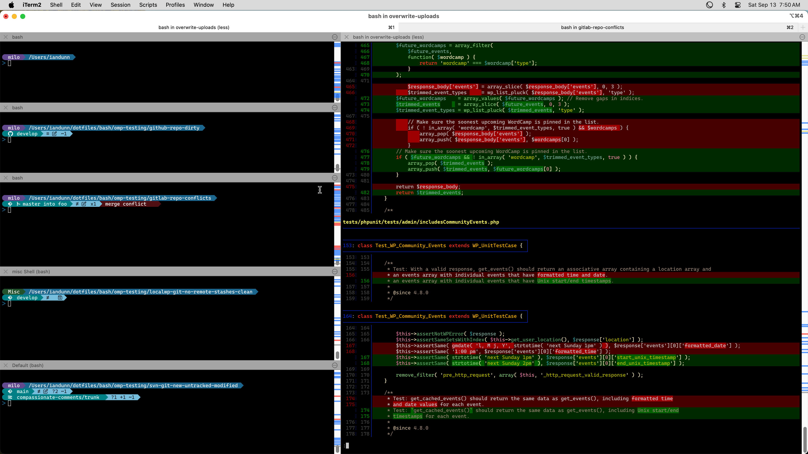

# dotfiles

These are my config files for various programs. They implement my preferences, tweaks, and workflow optimizations.

These are some things that might be useful to others:

* [bash](./bash/) - Custom theme for [Oh My Posh](https://ohmyposh.dev/) (see screenshot below); aliases; helper functions, SSH tab completion, deploy script wrapper, and general configuation.
* [git](./git) - Configuration for commit signing with per-repository overrides; syntax-highlighted diffs with [Delta](https://dandavison.github.io/delta/); hooks for good commit messages, linting, etc; lots of aliases; and general configuation. See screenshot below.
* [bin\generate-config-files](./bin/generate-config-files.sh) - Concatenates public and private SSH config files into `~/.ssh/config`. This lets you track your foundational and non-sensitive configuation, without disclosing private information.
* [ordinaryish](./keyboards/ergodox-ez/ordinaryish) - My custom keyboard layout for the [Ergodox EZ](https://ergodox-ez.com/) and [Colemak](https://colemak.com/) layout. Built with [QMK](https://qmk.fm/) firmware.
* [US No Dead Keys](./keyboards/US%20No%20Dead%20Keys/) - A mac keyboard layout that disables dead keys, to prevent typos.
* [localwp\ssh-entry](./localwp/ssh-entry) - Customizing BASH prompt, $PATH, etc for [Local WP](https://localwp.com/) SSH sessions
* [docs](./docs) - Processes and best practices for development flow and basic project management.

## Terminal prompt with [Oh My Posh](https://ohmyposh.dev/) and Git diff with [Delta](https://dandavison.github.io/delta/)

## Installation

In general, the original files from applications are symlinked to my custom files. In some cases, hard links need to be used for commands like `ssh` that don't follow symlinks.

1. `bash bin/install-homebrew-packages.sh`
1. `bash bin/install.sh` (symlinks all config files - overwrites existing)
1. `bash bin/generate-config-files.sh`
1. `bash bin/install-npm-packages.sh`
1. `bash bin/install.sh-wpcli-packages`
1. `bash bin/osx-apply-defaults.sh`
