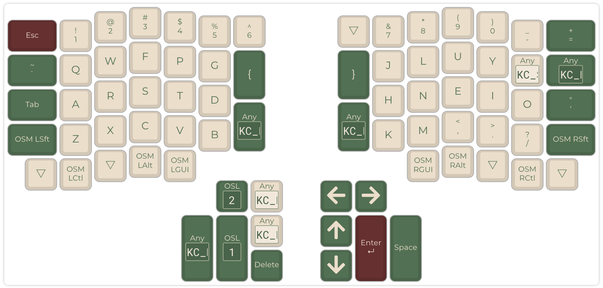
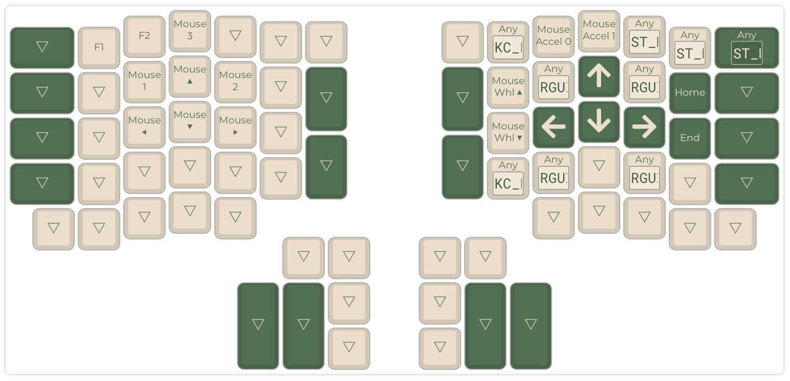
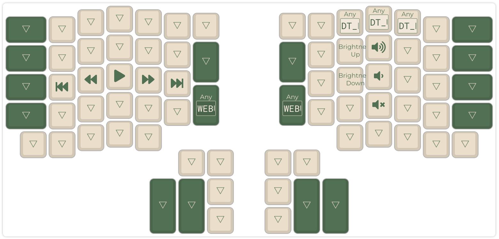

# ordinary-ish Ergodox EZ layout

The primary goal for this is to reduce RSI pain.
The secondary goal is to stay as close to an "ordinary" keyboard layout as possible, to reduce the learning curve and time spent creating it.

## Layer 0: Base



* Similar to [Ordinary](https://github.com/qmk/qmk_firmware/blob/7eb6f86bc0aac3ff83abe4365cd11c5c195dc403/layouts/community/ergodox/ordinary/readme.md), including arrow keys on the right thumb cluster.
* [Colemak](https://colemak.com/).
* Remove some hard-to-reach keys to avoid twisting and stretching hands. I'd like to remove more so that all keys are 1 distance from the home row and thumb cluster, but haven't found a layout I'm happy with.
* [One shot modifiers](https://github.com/qmk/qmk_firmware/blob/7eb6f86bc0aac3ff83abe4365cd11c5c195dc403/docs/one_shot_keys.md). Use these whenever possible, because chording contributes to RSI, and most of the modifiers are on hard to reach keys.

## Layer 1: Navigation, Mouse, Macros, Miscellaneous



* Home row arrow keys on the right hand. These are comfortable when you don't need to combine them with any modifiers. When you need to do things like `alt-left` to jump words though, the arrows on the base layer are sometimes easier to work with. The tradeoff is that you have to move your hand to get there, since the Ergodox thumb cluster so big that not all the thumb keys are accessible with a thumb.
* Tab navigation
* Home row mouse keys on the left hand.

## Layer 2: Volume, Play/Pause, etc




## Installation

1. [Setup QMK](https://docs.qmk.fm/#/newbs_getting_started). The latest release I've tested is `0.30.6`, but it may work on newer ones too.
1. Symlink this folder to `{qmk checkout}/keyboards/ergodox_ez/keymaps/iandunn/`
1. Set these config values
	```sh
	> qmk config
	multibuild.keymap=default
	user.keyboard=ergodox_ez
	user.keymap=iandunn
	```
1. `cd {qmk checkout}`
1. `qmk lint`
1. `qmk compile`
1. `qmk flash`
1. (optional) The [US No Dead Keys](https://github.com/iandunn/dotfiles/tree/master/keyboards/US%20No%20Dead%20Keys) can be used to avoid accidentally typing accents etc, but isn't necessary.
1. Test with [QMK Configurator's test mode](https://config.qmk.fm/#/test/)


## Visualization

1. `qmk c2json -km default -kb ergodox_ez --no-cpp -o keymap.json keymap.c`
1. Upload to the [QMK Configurator with the Ergodox-EZ layout](https://config.qmk.fm/#/ergodox_ez/base/LAYOUT_ergodox_pretty)
1. Choose `GMK Camping` theme
1. `rm -f keymap.json` (otherwise it'll take precedence over `keymap.c`, and changes to the latter won't take effect during `qmk compile`)